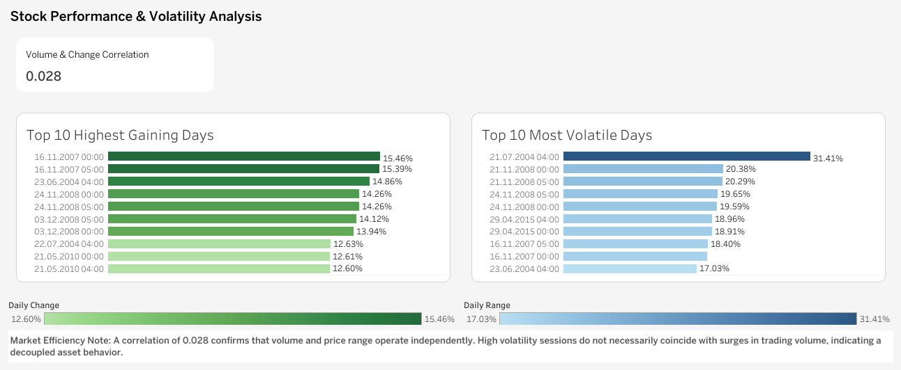

# Stock-Performance-Volatility-Analysis

> **[Live Dashboard on Tableau Public](https://public.tableau.com/app/profile/cavid.samilov/viz/Book2_17753996285830/Dashboard1?publish=yes)**
Analyzing stock market trends and volatility using a Kaggle dataset. Data processed in Excel/Power Query and visualized through an interactive Tableau dashboard.
## 📋 Project Overview & Business Questions
This project aims to uncover key insights from historical stock data by addressing the following questions:

1. **Which days had the highest percentage gains?**
   - Identified the top 10 performing days to understand peak market rallies.
2. **Does trading volume significantly impact price movement?**
   - Analysis revealed a correlation of **0.028**, suggesting that volume and price movements are largely decoupled for this asset.
3. **Which periods were the most volatile?**
   - Visualized the top 10 days with the largest price swings (Daily Range) to identify high-risk sessions.
### 1. Data Cleaning (Excel & Power Query)
Raw data was imported into Excel, and date formats and necessary calculations (Daily Range, Daily Change) were performed using Power Query.

## 🛠️ Tools & Methodology
- **Excel & Power Query:** Used for initial data processing, date formatting, and calculating daily performance metrics.
- **Tableau:** Designed an interactive, modern UI/UX dashboard to present the findings clearly.

## 📊 Visualizations
- **Top 10 Highest Gaining Days:** Green-themed bar chart highlighting the best performance.
- **Top 10 Most Volatile Days:** Blue-themed bar chart identifying maximum price fluctuations.
- **Correlation KPI:** A dedicated card showing the relationship between Volume and Price Change.

---
*Data Source: Kaggle*
